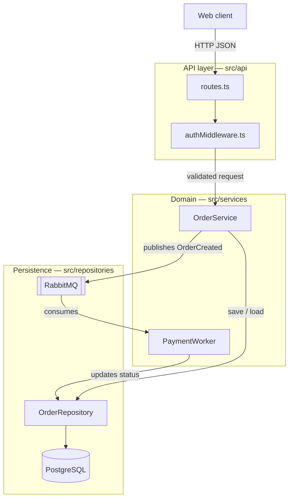
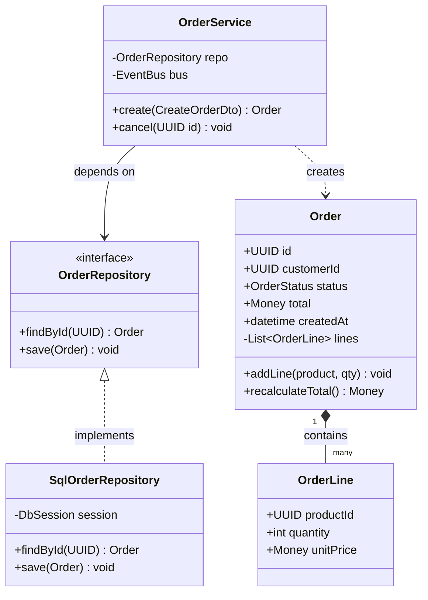
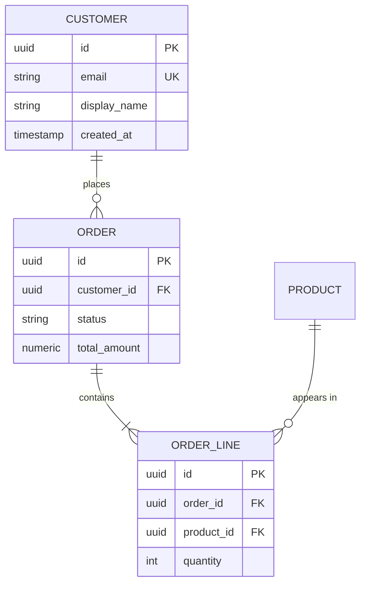
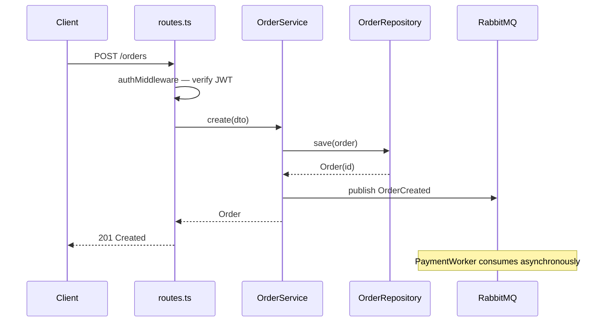
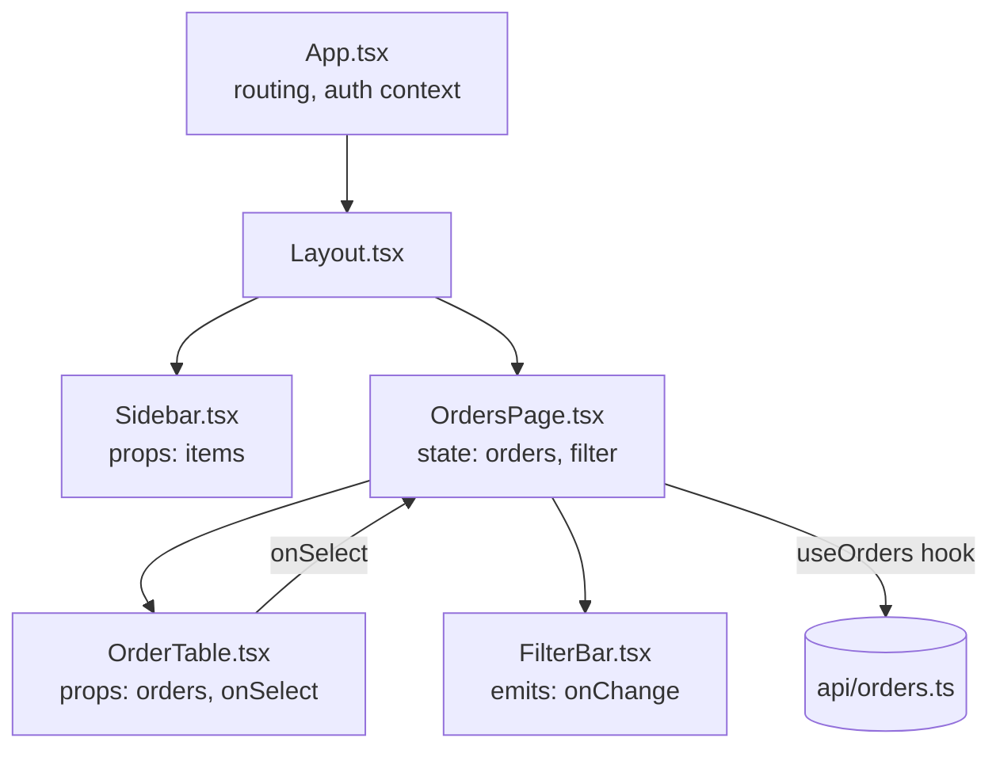
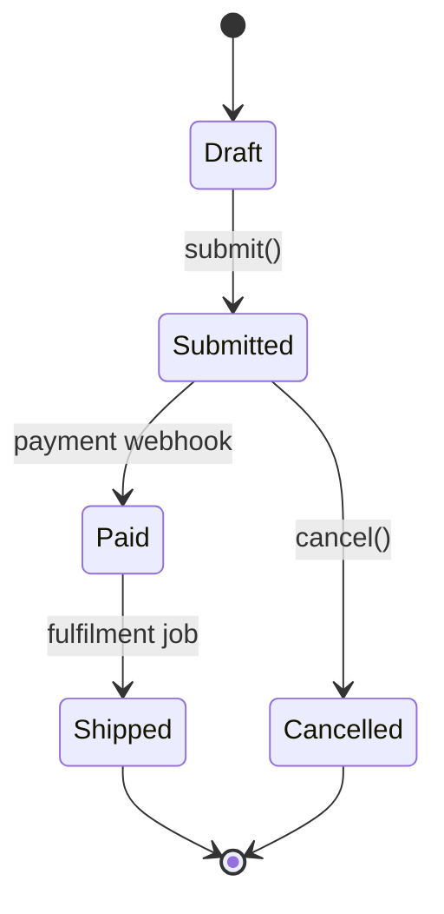

# Mermaid recipes for structure documents

Worked examples for the diagram types a structure doc needs, plus the syntax traps that
silently break rendering. Copy a shape from here and fill it with what the code actually says.

**Contents**

1. System overview (flowchart)
2. Class structure with fields (classDiagram)
3. Data model (erDiagram)
4. Request / job walkthrough (sequenceDiagram)
5. Frontend component tree (flowchart)
6. State machine (stateDiagram-v2)
7. Syntax traps that break rendering
8. Adapting to stacks without classes

---

## 1. System overview (flowchart)

Every document has one. Subgraphs carry the layering; edge labels carry the meaning.

````markdown

````

Node shapes are worth using consistently: `[box]` for code modules, `[(cylinder)]` for
databases, `[[subroutine]]` for queues and brokers, `{diamond}` for branching, `([stadium])`
for external services.

---

## 2. Class structure with fields (classDiagram)

Fields with types are the point — they are what tells a reader what the object *is*. Include
visibility markers (`+` public, `-` private, `#` protected), the field types, and the methods
that matter. Skip trivial getters.

````markdown

````

Relation arrows, in the order you'll reach for them:

| Meaning | Syntax |
|---|---|
| inheritance / implements | `Base <|-- Derived` , `Iface <|.. Impl` |
| composition (owns, dies with) | `Whole "1" *-- "many" Part` |
| aggregation (holds, outlives) | `Team o-- Member` |
| association / depends on | `A --> B` |
| uses transiently | `A ..> B` |

Generics use tildes: `List~OrderLine~`, not `List<OrderLine>`.

---

## 3. Data model (erDiagram)

````markdown

````

Cardinality reads left-entity-first: `||` exactly one, `o|` zero or one, `}o` zero or many,
`}|` one or many. `CUSTOMER ||--o{ ORDER` is "one customer, zero or more orders".

---

## 4. Request / job walkthrough (sequenceDiagram)

Use this for the one or two paths that explain the system. Name real files and methods.

````markdown

````

`->>` solid call, `-->>` dashed return, `-)` fire-and-forget async.

---

## 5. Frontend component tree (flowchart)

Note props going down and events coming up — that's the wiring a reader needs.

````markdown

````

---

## 6. State machine (stateDiagram-v2)

````markdown

````

---

## 7. Syntax traps that break rendering

A diagram that doesn't render is worse than no diagram, and these are the reasons it usually
doesn't:

- **Parentheses, colons, slashes, or quotes inside a node label** — wrap the label in quotes:
  `A["handler (async)"]`. Unquoted `(` inside `[...]` breaks the parse.
- **Line breaks in labels** — use `<br/>`, never a real newline.
- **Generics with angle brackets** — `List~Item~` in classDiagram; angle brackets are parsed
  as HTML elsewhere and vanish.
- **Node ids with spaces, dots, or dashes** — ids must be simple identifiers. Put the pretty
  name in the label: `OrderSvc[Order Service]`, not `Order Service[...]` or `order.svc[...]`.
- **`end` as a node id or bare word** — it closes a subgraph. Use `End_` or quote it.
- **Reserved words in flowchart ids** — `graph`, `class`, `click`, `style`, `default`, `o`, `x`.
- **Comments** — `%%` at line start only, never trailing on a node line.
- **Edge labels with special characters** — quote them: `A -->|"reads/writes"| B`.
- **Mixing diagram types in one block** — one diagram per fenced block, declaration on line one.
- **Indentation inside `classDiagram` class bodies** — consistent indentation, one member per line.

When a diagram grows past ~15 nodes, the fix is splitting it by module, not shrinking the
labels. A diagram nobody can read has no reason to be in the document.

---

## 8. Adapting to stacks without classes

`classDiagram` is the wrong tool for plenty of codebases. Keep the intent — show the units and
what fields/data they carry — and change the form:

- **Go / Rust / C structs** — `classDiagram` still fits: struct fields as fields, methods with
  receivers as methods, `..>` for "this package uses that one".
- **Python / JS modules of functions** — `flowchart` where nodes are modules, labelled with
  their key exported functions, and edges are imports. Add a `classDiagram` only for the data
  shapes (dataclasses, Pydantic models, TypeScript interfaces), which is where the fields live.
- **SQL-heavy or ETL projects** — `erDiagram` for the schema plus a `flowchart` of the pipeline
  stages, labelling edges with the table or file produced at each step.
- **Microservices** — a `flowchart` of services with protocol-labelled edges
  (`REST`, `gRPC`, `Kafka: orders.created`), then a per-service diagram in that service's section.
- **X++ / Dynamics 365 F&O** — tables and their key fields as a `classDiagram` or `erDiagram`,
  extension classes linked to what they extend with `<|--`, and a `flowchart` for the
  posting/journal flow across forms, data entities, and services.
- **Infrastructure as code** — `flowchart` of resources with edges for dependency direction.
