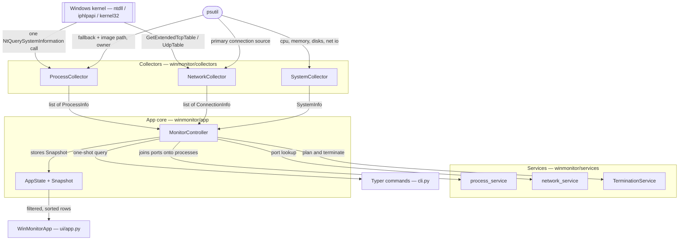
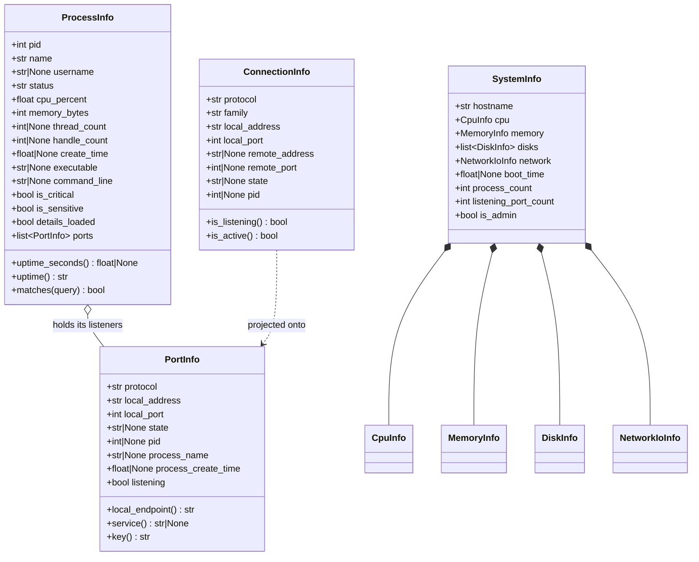
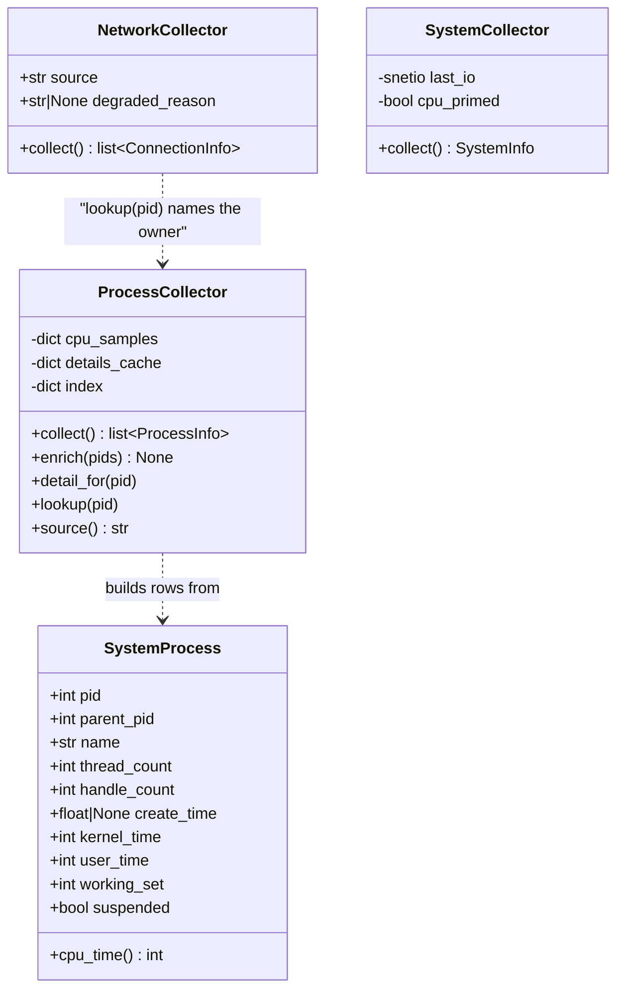
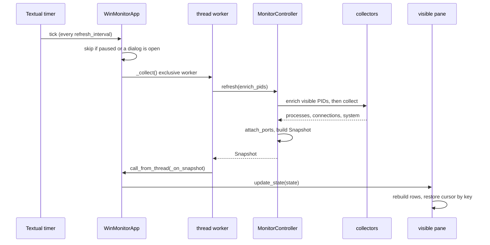
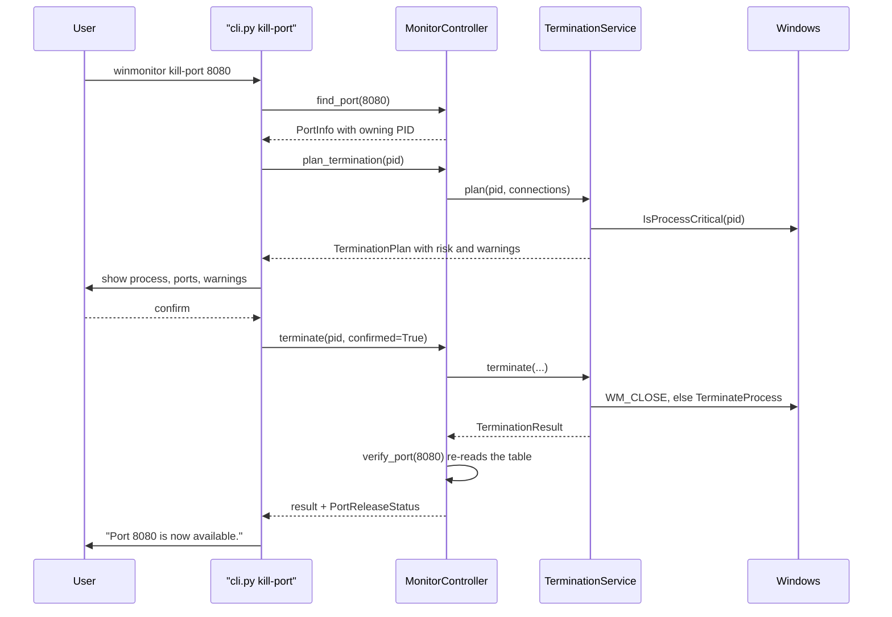

# Project Structure — WinMonitor

> Generated 2026-09-17 · 67 files · Python 3.12+ / Textual / psutil / ctypes · basis: `25d9d1b` on `main`

Where everything lives and how the pieces are wired. For the reasoning behind the design —
why the process table is read the way it is, the threading model, the full Windows API
table — see [docs/ARCHITECTURE.md](docs/ARCHITECTURE.md). This document answers *where*;
that one answers *why*.

---

## Overview

WinMonitor is a terminal system monitor for Windows 11. It lists processes, ports and network
connections, and connects the two directions developers actually need: *which process owns
port 8080*, and *what is this process listening on*. It can then stop that process safely and
verify the port was released.

It ships two front ends over one core: a live Textual TUI and a one-shot Typer CLI. Both go
through the same controller, so they can never disagree about what is running.

## Tech stack

| | |
|---|---|
| Language | Python 3.12+ (developed on 3.14) |
| TUI | [Textual](https://textual.textualize.io/) + Rich |
| CLI | Typer |
| Models & config | Pydantic v2, `tomllib` |
| System data | psutil, and `ctypes` straight to Windows APIs |
| Tests | pytest, pytest-asyncio |
| Quality | ruff, black, mypy (line length 100) |
| Packaging | setuptools; PyInstaller for the standalone `.exe` |

```bash
pip install -e ".[dev]"        # install with dev tooling
winmonitor                     # run the live interface
python -m pytest               # 358 tests, a few seconds
python -m PyInstaller packaging/winmonitor.spec --noconfirm   # build the exe
```

---

## Directory tree

```
WinMonitor/
├── winmonitor/                  the application package
│   ├── __main__.py              entry point for `python -m winmonitor`
│   ├── cli.py                   every Typer command; the whole CLI surface
│   │
│   ├── utils/                   cross-cutting helpers, no project state
│   │   ├── windows.py           ctypes bindings: the only file that talks to Win32 directly
│   │   ├── formatting.py        bytes, percentages, durations, endpoints, text meters
│   │   └── permissions.py       administrator detection and elevation guidance
│   │
│   ├── models/                  typed records passed between every layer
│   │   ├── process.py           ProcessInfo + the ProcessSort enum
│   │   ├── port.py              PortInfo + the developer port catalogue
│   │   ├── connection.py        ConnectionInfo
│   │   └── system.py            CpuInfo, MemoryInfo, DiskInfo, NetworkIoInfo, SystemInfo
│   │
│   ├── collectors/              read the machine; the only layer that does
│   │   ├── processes.py         the process table, via one NtQuerySystemInformation call
│   │   ├── network.py           TCP/UDP endpoints, with three layers of fallback
│   │   └── system.py            CPU, memory, disks, network throughput, uptime
│   │
│   ├── services/                pure logic over an already-collected snapshot
│   │   ├── process_service.py   filtering, sorting, the process-to-port join
│   │   ├── network_service.py   port lookup both ways, developer port detection
│   │   └── termination_service.py   planning and performing terminations
│   │
│   ├── app/                     application core, no UI
│   │   ├── state.py             Snapshot (one reading) and AppState (+ user choices)
│   │   ├── controller.py        MonitorController: owns the collectors
│   │   └── events.py            Textual messages posted from worker threads
│   │
│   ├── ui/                      the Textual interface
│   │   ├── app.py               WinMonitorApp: bindings, workers, termination flow
│   │   ├── app.tcss             stylesheet (data, not code — bundled explicitly in the exe)
│   │   ├── widgets.py           meters, tiles, status bar, confirmation dialogs, help
│   │   ├── table_pane.py        base class for the three table views
│   │   ├── dashboard.py         the system overview pane
│   │   ├── processes.py         the process table pane
│   │   ├── ports.py             the ports pane
│   │   ├── connections.py       the connections pane
│   │   ├── process_details.py   process detail screen + shared renderer
│   │   └── port_details.py      port detail screen + shared renderer
│   │
│   ├── config/
│   │   ├── settings.py          the Settings model and config.toml discovery
│   │   └── logging_setup.py     rotating file log
│   │
│   └── exporters/
│       ├── json_exporter.py     JSON with provenance
│       └── csv_exporter.py      CSV, UTF-8 BOM for Excel
│
├── tests/                       358 tests, none dependent on live processes
│   ├── conftest.py              synthetic fixtures + a pinned clock
│   └── test_*.py                one module per area under test
│
├── packaging/                   the standalone build
│   ├── winmonitor.spec          PyInstaller recipe
│   ├── entry.py                 absolute-import entry point for the frozen build
│   └── version_info.txt         Windows version resource
│
├── scripts/
│   └── install-shortcuts.ps1    desktop / Start Menu shortcuts, incl. an elevated one
│
├── docs/
│   ├── ARCHITECTURE.md          the reasoning: design decisions, Windows APIs, testing
│   └── structure-history/       survey snapshots, for diffing future versions
│
├── test-versions/               the original prototypes, kept for reference
├── pyproject.toml               packaging + ruff/black/mypy/pytest configuration
└── README.md                    the user-facing guide
```

---

## Modules

### `winmonitor/utils` — helpers with no project state

`windows.py` is the load-bearing file of the whole project and the only one that touches
Win32. It wraps `NtQuerySystemInformation` (the process table), `GetExtendedTcpTable` /
`GetExtendedUdpTable` (connections), `IsProcessCritical`, `GetPhysicallyInstalledSystemMemory`,
`EnumWindows` / `PostMessageW` (WM_CLOSE) and console/privilege calls. Every function returns a
safe default when its API is unavailable, which is what lets the module import on a
non-Windows machine so the test suite runs anywhere. `formatting.py` is the single place a
byte count or a duration is turned into text, so those look identical in the TUI, the CLI and
the exports.

### `winmonitor/models` — the vocabulary

Pydantic models carrying data between layers. Computed fields mean a record holds both the raw
value and the readable one (`uptime_seconds` *and* `uptime`), so an export serves a script and
a human from the same row. `port.py` also owns `DEVELOPER_PORTS`, the catalogue of 31 well
known ports used by the developer view and by `winmonitor port`.

### `winmonitor/collectors` — everything that reads the machine

`processes.py` reads the whole process table in a single kernel call and computes CPU
percentages from kernel+user time deltas; the three attributes that need a per-process handle
(image path, command line, owner) are resolved lazily and cached per process lifetime.
`network.py` tries psutil, then the ctypes tables, then `netstat -ano`, recording which layer
produced the snapshot. `system.py` samples CPU, memory, disks and network throughput without
blocking. All three are stateful by design — counters are deltas since the previous call — so
they are created once and kept.

### `winmonitor/services` — logic, no I/O

Pure functions over a snapshot: filtering, sorting, the process-to-port join, port lookup in
both directions. `termination_service.py` is the exception that performs an action, and it is
the safety boundary: it refuses any request that does not arrive with `confirmed=True`,
classifies a process as normal/sensitive/critical, and verifies afterwards whether the port
actually came free.

### `winmonitor/app` — the core both front ends share

`Snapshot` is one consistent reading; `AppState` adds the user's search text, sort order and
selection and derives what each screen shows. `MonitorController` is the only object that
talks to the collectors, and both the TUI and the CLI go through it.

### `winmonitor/ui` — the Textual interface

`app.py` holds the key bindings, the refresh worker and the termination flow. Each view is its
own module, and the three table views share `table_pane.py`, which rebuilds rows about once a
second while keeping the cursor on the same *row key* so a selected process stays selected
even when sorting moves it.

### Smaller pieces

- **`winmonitor/config`** — `Settings` plus `config.toml` discovery (`--config`, then the
  working directory, then `%APPDATA%`); a malformed file is reported and ignored, never fatal.
- **`winmonitor/exporters`** — JSON (with provenance) and CSV (UTF-8 BOM so Excel reads
  non-ASCII paths correctly).
- **`packaging/`** — the PyInstaller recipe; it exists because the stylesheet is data and
  several Textual widgets are imported lazily, neither of which the bundler infers.
- **`scripts/install-shortcuts.ps1`** — creates desktop and Start Menu entries; works with
  either the pip install or the standalone exe.
- **`test-versions/`** — the two prototype scripts this grew out of, excluded from the
  formatters so they stay as originally written.

---

## Architecture diagrams

### System overview



### Models — fields and types



### Collectors — state and sources



### One refresh tick



### Freeing a port



---

## Key flows

### 1. A live refresh

1. `ui/app.py` `_tick()` fires on the interval and returns early if paused or a dialog is open.
2. `_collect()` — an *exclusive* thread worker — calls `MonitorController.refresh()`. If a
   previous refresh is still running, the new one is dropped rather than queued.
3. `controller.py` `refresh()` enriches the PIDs currently on screen, then calls
   `ProcessCollector.collect()`, `NetworkCollector.collect()` and `SystemCollector.collect()`,
   joins ports onto processes with `process_service.attach_ports()` and builds a `Snapshot`.
4. The worker hands it back via `call_from_thread(_on_snapshot)` — the only safe way to touch
   widgets from a thread.
5. `_refresh_pane()` calls `update_state()` on the visible pane, which rebuilds its rows and
   restores the cursor by row key.

### 2. `winmonitor port 8080`

1. `cli.py` `cmd_port()` builds a controller and calls `find_port()`.
2. `controller.find_port()` collects a fresh connection snapshot and calls
   `network_service.find_port()`, which returns every endpoint bound to that port — normally
   two, one per address family.
3. `_enrich_port()` fills in image path, command line and owner for the owning PID.
4. `ui/port_details.py` `render_port_details()` renders it — the same function the TUI detail
   screen uses.

### 3. Stopping a process from the TUI

1. <kbd>K</kbd> → `action_kill()` → `_termination_flow(pid, force=False)`.
2. `plan_termination()` returns a `TerminationPlan` carrying the ports held and the risk level.
3. A normal process gets one `ConfirmScreen` (Y/N). Force, or anything Windows reports as
   critical, gets `TypedConfirmScreen`, which requires the word `KILL`.
4. On confirmation `TerminationService.terminate()` posts `WM_CLOSE`; a process with no window
   is terminated directly, while one that *has* a window and ignores the request is reported
   back rather than force-killed, in case it is showing a save prompt.
5. `verify_port()` re-reads the connection table and reports whether the port is free, still
   listening, or winding down in `TIME_WAIT`.

---

## Conventions

- **Where new code goes.** Anything that reads the machine belongs in `collectors/`; anything
  that reasons over a snapshot belongs in `services/` and must stay free of I/O. The UI never
  calls a collector directly — it goes through `MonitorController`.
- **Windows APIs live in one file.** New `ctypes` bindings go in `utils/windows.py` and must
  degrade to a safe default off Windows, or the test suite stops being portable.
- **Formatting is centralised.** Render values through `utils/formatting.py` rather than
  inline f-strings, so the three front ends agree.
- **Unknown is not zero.** A value Windows would not give up is `None` and renders as `-`. The
  first CPU sample is unknown, not `0.0`.
- **Dynamic text is a Rich `Text` object**, never a markup string — process names and command
  lines are attacker-influenced on a shared machine.
- **Tests never touch live processes.** Fixtures are synthetic, `time.time` is pinned, the
  kernel process table is replaced with a list the test controls. Add new fixtures to
  `tests/conftest.py`.
- **Style.** Line length 100, enforced by ruff and black; `test-versions/` is excluded.

---

## Version history

### 2026-09-17 — first generation
*Basis: `25d9d1b` on `main` · 67 files, 11,343 code lines · tier: medium*

Initial structure document. No previous version to compare against; the survey snapshot in
`docs/structure-history/survey-2026-09-17.json` is the baseline a later run will diff against
to detect additions, removals and renames exactly.

<!-- project-structure-meta
generated: 2026-09-17T22:50:00+03:00
basis: git 25d9d1b (main)
files: 67
tier: medium
survey: docs/structure-history/survey-2026-09-17.json
-->
